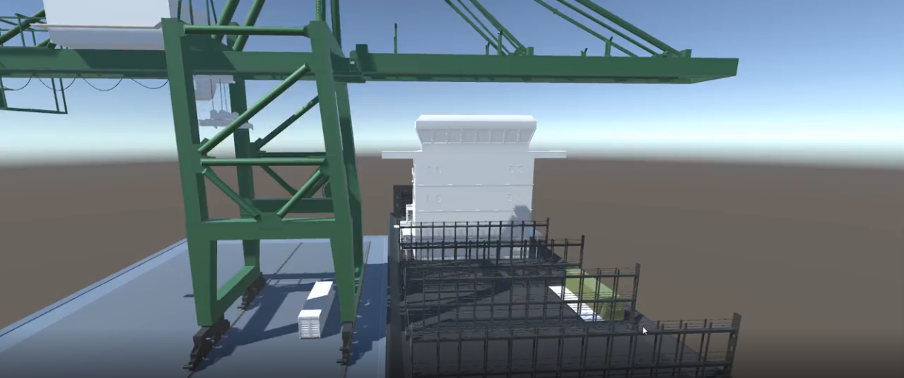

**Built with:** Unity3D · ML-Agents · PPO · SAC

## Overview
The aim of this project was to disprove the hypothesis of a colleague at the time, who stated that AI / ML could never replace quay crane operators.
At the time, I was still a crane operator, with an interest in machine learning, determined to prove my colleague wrong.
This sparked a year-long research journey to explore whether RL could learn to effectively operate a quay crane.

::: {.column-margin}
**Key Insight:** By the end, I was (and still am) convinced that with enough resources, RL can perform 95% of the tasks a crane operator does.
:::

## Challenges

**Simulation**

There was no quay crane simulation freely available. Commercial simulations existed, but they were not aimed at reinforcement learning and were prohibitively expensive.
The only practical solution was to develop a custom simulator using the Unity3D game engine, which also served as the training backbone via the ML-Agents package.
The simulation started out basic but grew in fidelity as the project progressed.

**Navigating Unfamiliar Territory**

At the time I had a strong interest in AI but lacked formal training or hands-on experience.
Unity3D's ML-Agents package provided curated, well-tested implementations of PPO and SAC, which allowed me to focus on the aspects of RL that mattered most: environment design, reward shaping, and learning curricula.

**Limited Resources**

Working without dedicated hardware meant visual inputs — as would be used in a production system — were not feasible.
Instead, the model received structured positional inputs: crane position, spreader position and velocity, spreader distance to key objects, and a target location for the spreader.
This constraint pushed cleaner state space design and faster iteration.

**Complex Target Behaviour**

The goal was not simply to move containers, but to do so safely — respecting operational safety rules and equipment limits.
This is a skill that takes human operators months to develop.
To address this, I designed a training curriculum that introduced progressively harder tasks as the model mastered each stage, guiding it from basic movement control through to safe, constrained container placement.

## Training Process

In the video below, you can see the different stages of how the model learned.

```{=html}
<div style="position:relative; width:100%; aspect-ratio:16/9;">
  <iframe style="position:absolute; top:0; left:0; width:100%; height:100%;"
    src="https://www.youtube.com/embed/U9P5iYCrD-k?si=1VNXOxR6nzeM7TVu&amp;start=3"
    title="YouTube video player" frameborder="0"
    allow="accelerometer; autoplay; clipboard-write; encrypted-media; gyroscope; picture-in-picture; web-share"
    allowfullscreen>
  </iframe>
</div>
```

## Conclusion

The project succeeded in its core goal. The trained agent learned to place containers precisely against existing stacks on a vessel, actively control spreader swing, and consistently respect the safety rules around minimum safe lift heights — behaviours that take human operators months to internalise.

This convinced me that with sufficient compute and a well-designed environment, RL can realistically automate the majority of quay crane operations. The remaining gap lies not in the algorithm, but in simulation fidelity and resource investment.

It was this realisation — that the domain I knew best was on the cusp of a fundamental shift — that led me to enrol in the Turing College data science programme and pursue a full career transition into the field.

From here, the most natural extension would be expanding the scope to include shipboard operations: hatch cover handling, container discharge sequencing, and lashing coordination — tasks that today still depend entirely on human judgment.
